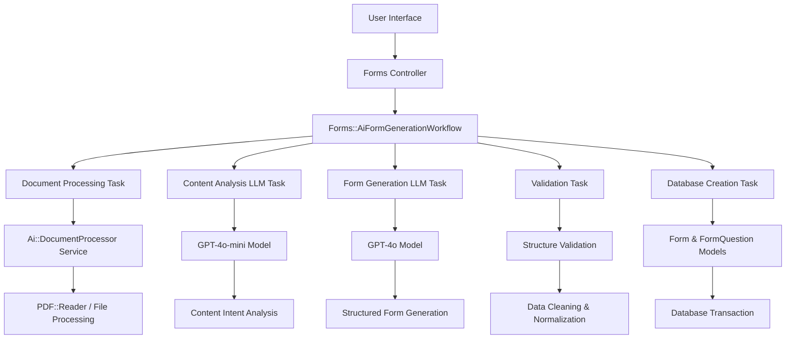

# Design Document

## Overview

The AI Form Generation system is designed as a comprehensive, multi-layered architecture that transforms user input (text prompts or documents) into intelligent, professionally structured forms. The system leverages the SuperAgent workflow framework to orchestrate complex AI operations while maintaining the reliability and scalability required for enterprise-grade form generation.

The architecture follows AgentForm's established pattern: **Controllers → Agents → Workflows → Tasks (LLM/DB/Stream) → Services**, ensuring consistency with the existing codebase while introducing sophisticated AI capabilities.

## Architecture

### High-Level Architecture Flow



### Core Components Architecture

The system is built around four primary architectural layers:

1. **Presentation Layer**: Enhanced UI with Stimulus controllers for real-time interaction
2. **Workflow Orchestration Layer**: SuperAgent workflow managing the entire generation process
3. **AI Processing Layer**: LLM tasks for content analysis and form generation
4. **Data Persistence Layer**: Optimized database operations with transaction safety

## Components and Interfaces

### 1. Document Processing Service (`app/services/ai/document_processor.rb`)

**Purpose**: Validates and extracts content from uploaded documents with comprehensive error handling.

**Key Interfaces**:
```ruby
class Ai::DocumentProcessor
  include ActiveModel::Model
  include ActiveModel::Attributes

  attribute :file
  attribute :content_type  
  attribute :file_size

  def process
    # Returns: { success: boolean, content: string, metadata: hash, source_type: string }
  end

  private

  def extract_pdf_content
    # Uses PDF::Reader for page-by-page extraction
  end

  def extract_text_content  
    # Handles Markdown and plain text with UTF-8 encoding
  end
end
```

**Validation Rules**:
- File presence validation
- Content type inclusion: `['application/pdf', 'text/markdown', 'text/plain']`
- File size limit: 10 megabytes
- Content length validation: 10-5000 words

### 2. SuperAgent Workflow (`app/workflows/forms/ai_form_generation_workflow.rb`)

**Purpose**: Orchestrates the entire form generation process through a series of coordinated tasks.

**Workflow Tasks**:

#### Task 1: `validate_and_prepare_content`
- Validates user AI credit limits
- Processes document or prompt input
- Enforces content length constraints
- Returns structured content data with metadata

#### Task 2: `analyze_content_intent` (LLM Task)
- **Model**: GPT-4o-mini
- **Temperature**: 0.3
- **Response Format**: JSON
- **Output Schema**:
```json
{
  "form_purpose": "string",
  "target_audience": "string", 
  "data_collection_goal": "string",
  "recommended_approach": "survey|lead_capture|feedback|registration|assessment|other",
  "estimated_completion_time": "number",
  "complexity_level": "simple|moderate|complex",
  "suggested_question_count": "number",
  "key_topics": ["array"],
  "requires_branching_logic": "boolean"
}
```

#### Task 3: `generate_structured_questions` (LLM Task)
- **Model**: GPT-4o
- **Temperature**: 0.2
- **Response Format**: JSON
- **Strict Schema Enforcement**: form_meta, questions array, form_settings
- **Question Configuration**: Uses FormQuestion::QUESTION_TYPES with position rationale

#### Task 4: `validate_and_clean_structure`
- Validates generated JSON structure
- Enforces business rules (max 20 questions, valid categories)
- Cleans and normalizes data for database insertion

#### Task 5: `create_optimized_form`
- Creates Form and FormQuestion records within database transaction
- Applies AI enhancements based on content analysis
- Calculates and tracks AI credit usage

### 3. Enhanced User Interface Components

#### Stimulus Controllers

**TabsController** (`app/javascript/controllers/tabs_controller.js`):
- Manages prompt vs document input switching
- Handles default tab selection based on URL parameters

**AiFormGeneratorController** (`app/javascript/controllers/ai_form_generator_controller.js`):
- Manages form submission state
- Handles loading indicators and progress feedback
- Integrates with workflow status updates

**FormPreviewController** (`app/javascript/controllers/form_preview_controller.js`):
- Provides real-time word count feedback
- Updates cost estimates based on content length
- Manages preview functionality

**FileUploadController** (`app/javascript/controllers/file_upload_controller.js`):
- Implements drag-and-drop file upload
- Provides visual feedback for file selection
- Validates file types and sizes client-side

#### UI Layout Structure

```erb
<div data-controller="tabs ai-form-generator form-preview">
  <!-- Header with AI credits display -->
  <!-- Tabbed interface (prompt/document) -->
  <!-- Content input areas with validation -->
  <!-- Real-time feedback and cost estimation -->
  <!-- Submit button with loading states -->
</div>
```

### 4. AI Feature Configuration System

**Purpose**: Automatically configures appropriate AI enhancements based on form analysis.

**Feature Determination Logic**:
```ruby
def determine_ai_features(content_analysis)
  features = ['response_validation']
  
  case content_analysis['recommended_approach']
  when 'feedback', 'survey'
    features += ['sentiment_analysis', 'response_categorization']
  when 'lead_capture'
    features += ['lead_scoring', 'intent_detection']
  when 'assessment'
    features += ['answer_confidence_scoring', 'knowledge_gap_analysis']
  end
  
  features << 'dynamic_followup' if content_analysis['requires_branching_logic']
  features
end
```

**Question-Level AI Configuration**:
- Email questions: validation enhancement, format suggestions
- Phone questions: format normalization, country detection  
- Long text questions: sentiment analysis, keyword extraction, quality scoring

## Data Models

### Enhanced Form Model Extensions

```ruby
# Additional attributes for AI-generated forms
class Form < ApplicationRecord
  # Existing attributes...
  
  # AI-specific attributes
  attribute :ai_enabled, :boolean, default: false
  attribute :ai_configuration, :json, default: {}
  attribute :form_settings, :json, default: {}
  attribute :metadata, :json, default: {}
  
  # AI configuration structure
  # ai_configuration: {
  #   enabled: true,
  #   features: ['sentiment_analysis', 'lead_scoring'],
  #   confidence_threshold: 0.7,
  #   auto_analysis: true,
  #   enhancement_level: 'moderate'
  # }
  
  # metadata structure for AI forms
  # metadata: {
  #   generated_by_ai: true,
  #   generation_timestamp: '2024-01-01T00:00:00Z',
  #   estimated_completion_time: 5,
  #   content_analysis: { ... },
  #   ai_cost: 0.08
  # }
end
```

### Enhanced FormQuestion Model Extensions

```ruby
class FormQuestion < ApplicationRecord
  # Existing attributes...
  
  # AI-specific attributes
  attribute :ai_enhanced, :boolean, default: false
  attribute :ai_config, :json, default: {}
  attribute :metadata, :json, default: {}
  
  # AI config structure examples:
  # For email questions: { validation_enhancement: true, format_suggestions: true }
  # For text questions: { sentiment_analysis: true, keyword_extraction: true, quality_scoring: true }
  # For phone questions: { format_normalization: true, country_detection: true }
end
```

### User Model Extensions for AI Credits

```ruby
class User < ApplicationRecord
  # Existing attributes...
  
  # AI credit tracking
  attribute :ai_credits_used, :decimal, default: 0.0
  attribute :monthly_ai_limit, :decimal, default: 10.0
  
  def ai_credits_used_this_month
    # Calculate current month usage
  end
  
  def ai_credits_remaining
    monthly_ai_limit - ai_credits_used_this_month
  end
end
```

## Error Handling

### Comprehensive Error Management Strategy

**Document Processing Errors**:
```ruby
# In Ai::DocumentProcessor
rescue StandardError => e
  Rails.logger.error "Document processing failed: #{e.message}"
  { success: false, errors: ['Failed to process document'] }
end
```

**Workflow-Level Error Handling**:
- AI credit limit validation with specific error messages
- Content length validation with actionable feedback
- LLM response validation with retry mechanisms
- Database transaction rollback on any failure

**User-Facing Error Messages**:
- "Monthly AI usage limit exceeded" with upgrade options
- "Content too long (X words). Maximum 5000 words allowed."
- "Content too short. Please provide more detailed information."
- File-specific errors: "Unsupported file type", "File too large"

### Error Recovery Mechanisms

1. **Graceful Degradation**: If advanced AI features fail, fall back to basic form generation
2. **Retry Logic**: Automatic retry for transient LLM API failures
3. **State Preservation**: Maintain user input during error recovery
4. **Detailed Logging**: Comprehensive error logging for debugging and monitoring

## Testing Strategy

### Test Coverage Requirements

**Unit Tests**:
- `Ai::DocumentProcessor` service with various file types and edge cases
- Workflow task validation and error handling
- AI feature configuration logic
- Cost calculation accuracy

**Integration Tests**:
- Complete workflow execution from input to form creation
- Database transaction integrity
- AI credit tracking and limit enforcement
- Error handling across component boundaries

**System Tests**:
- End-to-end form generation from UI
- File upload functionality with various formats
- Real-time UI feedback and state management
- Cross-browser compatibility for Stimulus controllers

**Performance Tests**:
- Large document processing (up to 10MB)
- Concurrent form generation requests
- LLM response time monitoring
- Database query optimization validation

### Test Data Strategy

**Factory Definitions**:
```ruby
# spec/factories/ai_generated_forms.rb
FactoryBot.define do
  factory :ai_generated_form, parent: :form do
    ai_enabled { true }
    ai_configuration do
      {
        enabled: true,
        features: ['sentiment_analysis', 'response_validation'],
        confidence_threshold: 0.7,
        auto_analysis: true,
        enhancement_level: 'moderate'
      }
    end
    metadata do
      {
        generated_by_ai: true,
        generation_timestamp: Time.current.iso8601,
        ai_cost: 0.08
      }
    end
  end
end
```

**Mock LLM Responses**:
- Predefined JSON responses for consistent testing
- Error scenario simulation
- Performance benchmarking data

## Security Considerations

### Input Validation and Sanitization

**File Upload Security**:
- MIME type validation beyond file extension checking
- File size limits enforced at multiple layers
- Virus scanning integration for uploaded documents
- Temporary file cleanup after processing

**Content Processing Security**:
- Input sanitization for all user-provided content
- SQL injection prevention in dynamic queries
- XSS protection for generated form content
- Rate limiting for AI generation requests

**AI Model Security**:
- Prompt injection attack prevention
- Content filtering for inappropriate material
- API key rotation and secure storage
- Usage monitoring and anomaly detection

### Data Privacy and Compliance

**User Data Protection**:
- Encryption of sensitive form content at rest
- Secure transmission of all AI processing data
- Audit logging for all AI operations
- GDPR compliance for EU users

**AI Processing Privacy**:
- No persistent storage of user content in AI models
- Anonymization of content sent to LLM providers
- Clear data retention policies
- User consent management for AI features

## Performance Optimization

### Caching Strategy

**Content Analysis Caching**:
- Cache similar content analysis results
- Redis-based caching with appropriate TTL
- Cache invalidation on model updates

**Form Template Caching**:
- Cache frequently generated form structures
- Template-based generation for common use cases
- Intelligent cache warming strategies

### Database Optimization

**Query Optimization**:
- Proper indexing for AI-related queries
- Batch operations for form creation
- Connection pooling for high concurrency

**Transaction Management**:
- Minimal transaction scope for better performance
- Async processing for non-critical operations
- Database connection optimization

### AI Processing Optimization

**Model Selection Strategy**:
- Use GPT-4o-mini for analysis tasks (cost-effective)
- Use GPT-4o for generation tasks (higher quality)
- Implement model fallback mechanisms

**Request Optimization**:
- Batch processing where possible
- Intelligent retry mechanisms with exponential backoff
- Response streaming for large generations

## Monitoring and Observability

### Key Metrics Tracking

**Business Metrics**:
- Form generation success rate
- Average generation time
- AI credit consumption patterns
- User satisfaction scores

**Technical Metrics**:
- LLM API response times
- Database transaction performance
- Error rates by component
- System resource utilization

**Cost Metrics**:
- AI processing costs per form
- Credit usage trends
- Cost optimization opportunities
- Revenue impact analysis

### Alerting Strategy

**Critical Alerts**:
- AI service outages
- Database transaction failures
- Security breach attempts
- Cost threshold breaches

**Warning Alerts**:
- Performance degradation
- High error rates
- Unusual usage patterns
- Resource utilization spikes

This design provides a comprehensive foundation for implementing the AI Form Generation feature while maintaining the high standards of reliability, security, and performance required for enterprise-grade applications.