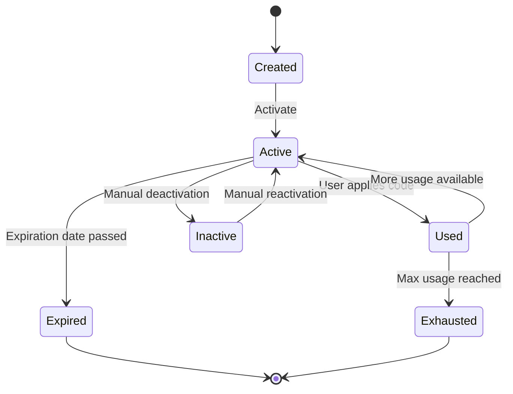
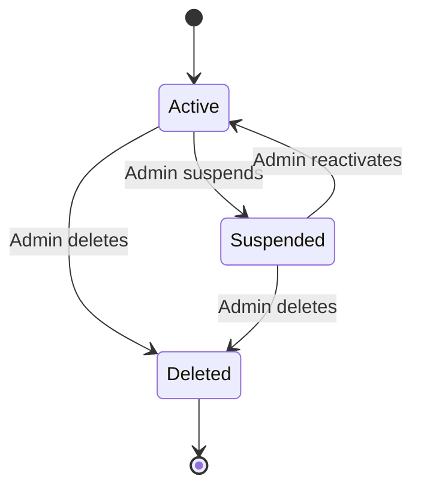

# Design Document

## Overview

The Superadmin Dashboard System is a comprehensive administrative interface that provides superadmins with complete control over user management and promotional discount codes. The system follows AgentForm's established architectural patterns and integrates seamlessly with the existing subscription management system.

## Architecture

### High-Level Architecture

The system follows the established AgentForm pattern:
**Controllers → Agents → Workflows → Tasks → Services**

```
Admin::DashboardController
├── Admin::UsersController
├── Admin::DiscountCodesController
└── Admin::SubscriptionsController (overview)

Admin::UserManagementAgent
├── Admin::UserManagementWorkflow
└── Admin::UserOperationsWorkflow

Admin::DiscountCodeAgent
├── Admin::DiscountCodeManagementWorkflow
└── Admin::DiscountValidationWorkflow

SubscriptionManagementService (enhanced)
├── DiscountCodeService
└── UserManagementService
```

### Database Schema

#### New Tables

**discount_codes**
```sql
CREATE TABLE discount_codes (
  id UUID PRIMARY KEY DEFAULT gen_random_uuid(),
  code VARCHAR(50) NOT NULL UNIQUE,
  discount_percentage INTEGER NOT NULL CHECK (discount_percentage BETWEEN 1 AND 99),
  max_usage_count INTEGER,
  current_usage_count INTEGER DEFAULT 0,
  expires_at TIMESTAMP,
  active BOOLEAN DEFAULT true,
  created_by_id UUID REFERENCES users(id),
  created_at TIMESTAMP NOT NULL,
  updated_at TIMESTAMP NOT NULL
);

CREATE INDEX idx_discount_codes_code ON discount_codes(LOWER(code));
CREATE INDEX idx_discount_codes_active ON discount_codes(active);
CREATE INDEX idx_discount_codes_expires_at ON discount_codes(expires_at);
```

**discount_code_usages**
```sql
CREATE TABLE discount_code_usages (
  id UUID PRIMARY KEY DEFAULT gen_random_uuid(),
  discount_code_id UUID NOT NULL REFERENCES discount_codes(id),
  user_id UUID NOT NULL REFERENCES users(id),
  subscription_id VARCHAR(255), -- Stripe subscription ID
  original_amount INTEGER NOT NULL, -- in cents
  discount_amount INTEGER NOT NULL, -- in cents
  final_amount INTEGER NOT NULL, -- in cents
  used_at TIMESTAMP NOT NULL DEFAULT CURRENT_TIMESTAMP,
  created_at TIMESTAMP NOT NULL,
  updated_at TIMESTAMP NOT NULL
);

CREATE INDEX idx_discount_usages_code ON discount_code_usages(discount_code_id);
CREATE INDEX idx_discount_usages_user ON discount_code_usages(user_id);
CREATE UNIQUE INDEX idx_one_discount_per_user ON discount_code_usages(user_id);
```

#### Enhanced Users Table

```sql
-- Add new columns to existing users table
ALTER TABLE users ADD COLUMN discount_code_used BOOLEAN DEFAULT false;
ALTER TABLE users ADD COLUMN suspended_at TIMESTAMP;
ALTER TABLE users ADD COLUMN suspended_reason TEXT;
```

## Components and Interfaces

### Admin Dashboard Layout

```
┌─────────────────────────────────────────────────────────┐
│ AgentForm Admin Dashboard                    [Profile ▼] │
├─────────────────────────────────────────────────────────┤
│ [Dashboard] [Users] [Discount Codes] [Subscriptions]    │
├─────────────────────────────────────────────────────────┤
│                                                         │
│  ┌─────────────┐ ┌─────────────┐ ┌─────────────┐       │
│  │   Users     │ │ Disc. Codes │ │Subscriptions│       │
│  │    1,247    │ │     12      │ │    892      │       │
│  │   Active    │ │   Active    │ │   Active    │       │
│  └─────────────┘ └─────────────┘ └─────────────┘       │
│                                                         │
│  Recent Activity                                        │
│  ┌─────────────────────────────────────────────────────┐ │
│  │ • User john@example.com registered                  │ │
│  │ • Discount code WELCOME20 used by mary@example.com │ │
│  │ • User suspended: spam@example.com                 │ │
│  └─────────────────────────────────────────────────────┘ │
└─────────────────────────────────────────────────────────┘
```

### User Management Interface

```
┌─────────────────────────────────────────────────────────┐
│ User Management                          [+ New User]   │
├─────────────────────────────────────────────────────────┤
│ Search: [________________] Filters: [Role ▼] [Tier ▼]   │
├─────────────────────────────────────────────────────────┤
│ Email              │ Name      │ Role │ Tier │ Status   │
├─────────────────────────────────────────────────────────┤
│ john@example.com   │ John Doe  │ User │ Prem │ Active   │
│ mary@example.com   │ Mary Jane │ User │ Free │ Active   │
│ admin@example.com  │ Admin     │ Admin│ Prem │ Active   │
└─────────────────────────────────────────────────────────┘
```

### Discount Code Management Interface

```
┌─────────────────────────────────────────────────────────┐
│ Discount Codes                      [+ Create Code]     │
├─────────────────────────────────────────────────────────┤
│ Code      │ Discount │ Usage    │ Expires   │ Status    │
├─────────────────────────────────────────────────────────┤
│ WELCOME20 │   20%    │ 45/100   │ Dec 2024  │ Active    │
│ SAVE10    │   10%    │ 12/50    │ Jan 2025  │ Active    │
│ EXPIRED   │   15%    │ 25/25    │ Nov 2024  │ Inactive  │
└─────────────────────────────────────────────────────────┘
```

### Controllers

#### Admin::DashboardController
```ruby
class Admin::DashboardController < Admin::BaseController
  def index
    @dashboard_stats = Admin::DashboardAgent.new.get_dashboard_stats
  end
end
```

#### Admin::UsersController
```ruby
class Admin::UsersController < Admin::BaseController
  def index
    @users = Admin::UserManagementAgent.new.list_users(params)
  end

  def show
    @user = User.find(params[:id])
    @user_details = Admin::UserManagementAgent.new.get_user_details(@user)
  end

  def edit
    @user = User.find(params[:id])
  end

  def update
    result = Admin::UserManagementAgent.new.update_user(params[:id], user_params)
    # Handle result...
  end

  def create
    result = Admin::UserManagementAgent.new.create_user(user_params)
    # Handle result...
  end

  def suspend
    result = Admin::UserManagementAgent.new.suspend_user(params[:id], params[:reason])
    # Handle result...
  end

  def destroy
    result = Admin::UserManagementAgent.new.delete_user(params[:id], params[:transfer_data])
    # Handle result...
  end
end
```

#### Admin::DiscountCodesController
```ruby
class Admin::DiscountCodesController < Admin::BaseController
  def index
    @discount_codes = Admin::DiscountCodeAgent.new.list_codes(params)
  end

  def show
    @discount_code = DiscountCode.find(params[:id])
    @usage_stats = Admin::DiscountCodeAgent.new.get_usage_stats(@discount_code)
  end

  def create
    result = Admin::DiscountCodeAgent.new.create_code(discount_code_params)
    # Handle result...
  end

  def update
    result = Admin::DiscountCodeAgent.new.update_code(params[:id], discount_code_params)
    # Handle result...
  end

  def toggle_status
    result = Admin::DiscountCodeAgent.new.toggle_status(params[:id])
    # Handle result...
  end

  def destroy
    result = Admin::DiscountCodeAgent.new.delete_code(params[:id])
    # Handle result...
  end
end
```

### Models

#### DiscountCode Model
```ruby
class DiscountCode < ApplicationRecord
  belongs_to :created_by, class_name: 'User'
  has_many :discount_code_usages, dependent: :destroy
  has_many :users, through: :discount_code_usages

  validates :code, presence: true, uniqueness: { case_sensitive: false }
  validates :discount_percentage, presence: true, inclusion: { in: 1..99 }
  validates :max_usage_count, numericality: { greater_than: 0 }, allow_nil: true

  scope :active, -> { where(active: true) }
  scope :expired, -> { where('expires_at < ?', Time.current) }
  scope :available, -> { active.where('expires_at IS NULL OR expires_at > ?', Time.current) }

  def expired?
    expires_at.present? && expires_at < Time.current
  end

  def usage_limit_reached?
    max_usage_count.present? && current_usage_count >= max_usage_count
  end

  def available?
    active? && !expired? && !usage_limit_reached?
  end

  def usage_percentage
    return 0 if max_usage_count.nil?
    (current_usage_count.to_f / max_usage_count * 100).round(1)
  end
end
```

#### DiscountCodeUsage Model
```ruby
class DiscountCodeUsage < ApplicationRecord
  belongs_to :discount_code
  belongs_to :user

  validates :user_id, uniqueness: true # One discount per user
  validates :original_amount, :discount_amount, :final_amount, presence: true, numericality: { greater_than: 0 }

  def savings_percentage
    return 0 if original_amount.zero?
    (discount_amount.to_f / original_amount * 100).round(1)
  end
end
```

### Services

#### DiscountCodeService
```ruby
class DiscountCodeService
  include ActiveModel::Model
  include ActiveModel::Attributes

  attribute :user
  attribute :code, :string

  def validate_code(code)
    discount_code = DiscountCode.find_by(code: code.upcase)
    
    return failure('Invalid discount code') unless discount_code
    return failure('Discount code has expired') if discount_code.expired?
    return failure('Discount code is no longer available') if discount_code.usage_limit_reached?
    return failure('Discount code is inactive') unless discount_code.active?
    return failure('You have already used a discount code') if user.discount_code_used?

    success(discount_code: discount_code)
  end

  def apply_discount(discount_code, original_amount)
    discount_amount = (original_amount * discount_code.discount_percentage / 100.0).round
    final_amount = original_amount - discount_amount

    {
      original_amount: original_amount,
      discount_amount: discount_amount,
      final_amount: final_amount,
      discount_percentage: discount_code.discount_percentage
    }
  end

  def record_usage(discount_code, user, subscription_details)
    ActiveRecord::Base.transaction do
      # Create usage record
      usage = DiscountCodeUsage.create!(
        discount_code: discount_code,
        user: user,
        subscription_id: subscription_details[:subscription_id],
        original_amount: subscription_details[:original_amount],
        discount_amount: subscription_details[:discount_amount],
        final_amount: subscription_details[:final_amount]
      )

      # Update discount code usage count
      discount_code.increment!(:current_usage_count)

      # Mark user as having used a discount
      user.update!(discount_code_used: true)

      # Deactivate code if usage limit reached
      if discount_code.usage_limit_reached?
        discount_code.update!(active: false)
      end

      usage
    end
  end
end
```

#### UserManagementService
```ruby
class UserManagementService
  include ActiveModel::Model

  def list_users(filters = {})
    users = User.includes(:forms, :payment_transactions)
    
    users = users.where('email ILIKE ?', "%#{filters[:search]}%") if filters[:search].present?
    users = users.where(role: filters[:role]) if filters[:role].present?
    users = users.where(subscription_tier: filters[:tier]) if filters[:tier].present?
    
    users.order(:created_at).page(filters[:page])
  end

  def get_user_details(user)
    {
      user: user,
      subscription_details: get_subscription_details(user),
      usage_stats: get_usage_stats(user),
      recent_activity: get_recent_activity(user)
    }
  end

  def suspend_user(user, reason)
    user.update!(
      suspended_at: Time.current,
      suspended_reason: reason,
      active: false
    )
    
    # Send suspension notification email
    UserMailer.account_suspended(user, reason).deliver_later
    
    success(message: 'User suspended successfully')
  end

  def create_user(user_params)
    user = User.new(user_params)
    user.password = SecureRandom.hex(8) # Temporary password
    
    if user.save
      # Send invitation email
      UserMailer.admin_invitation(user).deliver_later
      success(user: user)
    else
      failure(errors: user.errors.full_messages)
    end
  end
end
```

## Data Models

### Discount Code Lifecycle



### User Management States



## Error Handling

### Discount Code Validation Errors
- Invalid or non-existent code
- Expired discount code
- Usage limit exceeded
- User already used a discount code
- Inactive discount code

### User Management Errors
- Insufficient permissions
- User not found
- Cannot delete user with active subscriptions
- Email already exists
- Invalid role assignment

### Admin Access Errors
- Non-superadmin attempting admin access
- Session timeout
- Invalid admin token

## Testing Strategy

### Unit Tests
- DiscountCode model validations and methods
- DiscountCodeUsage model validations
- DiscountCodeService validation logic
- UserManagementService operations
- Admin controller authorization

### Integration Tests
- Complete discount code application flow
- User management operations
- Admin dashboard functionality
- Stripe integration with discount codes

### System Tests
- End-to-end admin workflows
- Discount code application during subscription
- User suspension and reactivation flows
- Admin dashboard navigation and functionality

### Security Tests
- Admin authorization enforcement
- Discount code abuse prevention
- User data protection in admin interface
- Rate limiting on discount code attempts

## Performance Considerations

### Database Optimization
- Indexes on frequently queried columns
- Pagination for large user lists
- Efficient discount code lookup
- Optimized admin dashboard queries

### Caching Strategy
- Cache active discount codes
- Cache user statistics for dashboard
- Cache subscription summaries
- Redis-based session management for admins

### Background Processing
- Async email sending for user invitations
- Background discount code expiration cleanup
- Async user suspension notifications
- Background usage statistics calculation