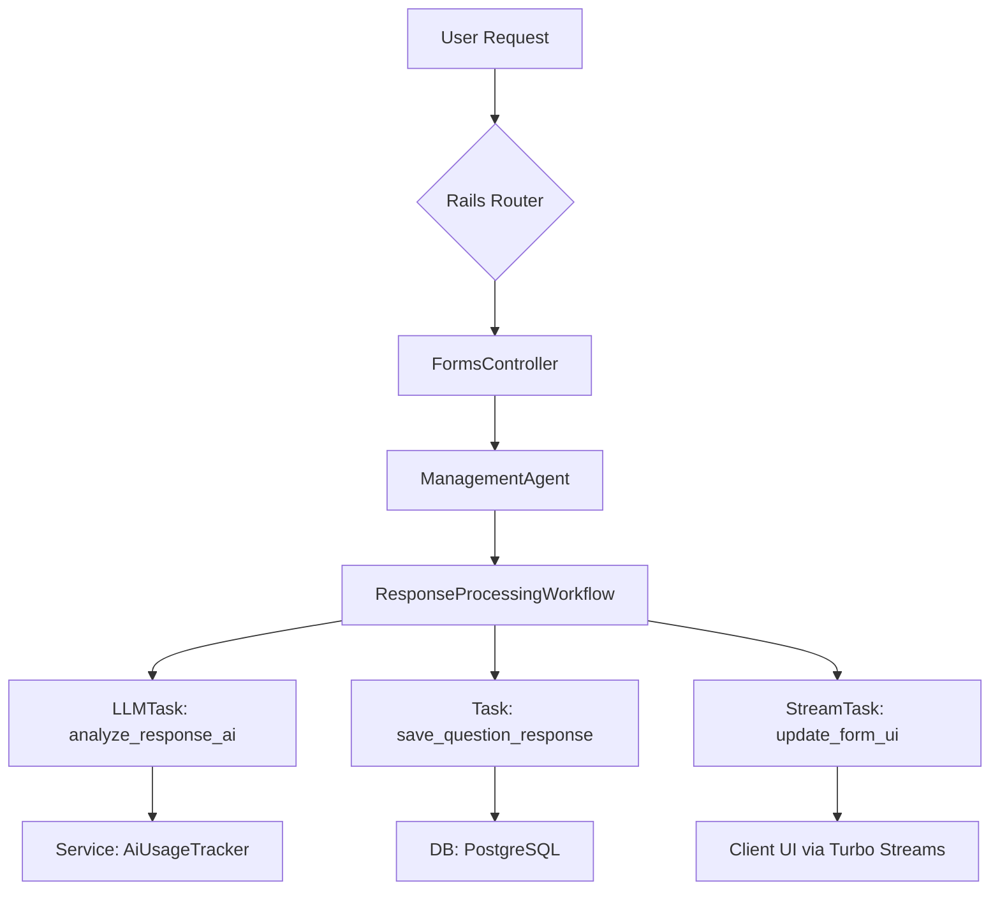

# Design Document: AgentForm Foundation & Core Setup

## 1. Introduction

This document provides the technical design and implementation approach for the foundational phase of the AgentForm project. It addresses the requirements outlined in `requirements.md` by specifying the application's structure, core components, and initial configurations. This blueprint will guide Kiro in generating the necessary code and files.

## 2. Architectural Flow Diagram

The following diagram illustrates the primary request/response flow through the application's core architecture.



## 3. Application & Environment Design

This section covers the technical setup of the Rails application as specified in **Requirement 1**.

*   **Rails Application:** A new Rails 7.1+ application will be generated. The `Gemfile` will be updated to include `pg`, `sidekiq`, `redis`, `devise`, `super_agent`, and `tailwindcss-rails`.
*   **Autoload Paths:** The `config/application.rb` file will be modified to add `app/agents`, `app/workflows`, and `app/services` to the autoload paths to support our custom architecture.
*   **Frontend:** The application will be configured to use Hotwire (Turbo and Stimulus) by default. Tailwind CSS will be set up via the `tailwindcss-rails` gem, with a custom `config/tailwind.config.js` file for defining the application's design system.
*   **Environments:** Standard Rails environment files (`development.rb`, `production.rb`) will be used. A `staging.rb` file will be created for the staging environment.

## 4. Core Architecture Design

This design addresses **Requirement 2** by defining the responsibilities of each layer in our `Controllers → Agents → Workflows → Tasks → Services` pattern.

*   **Base Classes:** Abstract base classes will be created for each layer to enforce consistency and provide shared functionality:
    *   `app/controllers/application_controller.rb`
    *   `app/agents/application_agent.rb`
    *   `app/workflows/application_workflow.rb`
    *   `app/services/application_service.rb`
*   **Error Handling:** Centralized error handling will be implemented in `ApplicationController` using `rescue_from` to catch common exceptions (e.g., `ActiveRecord::RecordNotFound`, `Pundit::NotAuthorizedError`, `SuperAgent::WorkflowError`).
*   **Serialization:** API responses will be serialized using a standard library like Jbuilder or ActiveModel::Serializers to ensure consistent JSON structures.

## 5. Database Schema & Model Design

This section details the implementation for **Requirement 3**.

*   **Primary Keys:** All database tables will be created with `id: :uuid` to use UUIDs as primary keys. The first migration will enable the `pgcrypto` extension.
*   **Core Models:** The following models will be created with the specified attributes and associations.

    ```ruby
    # app/models/user.rb
    class User < ApplicationRecord
      has_secure_password # or devise integration
      enum role: { user: 'user', premium: 'premium', admin: 'admin' }

      has_many :forms, dependent: :destroy
      has_many :api_tokens, dependent: :destroy
    end

    # app/models/form.rb
    class Form < ApplicationRecord
      belongs_to :user
      has_many :form_questions, -> { order(:position) }, dependent: :destroy
      has_many :form_responses, dependent: :destroy

      # The configuration fields will use the PostgreSQL `jsonb` type
      # for efficient querying.
      # attribute :form_settings, :jsonb
      # attribute :ai_configuration, :jsonb
      # attribute :style_configuration, :jsonb
    end

    # app/models/form_question.rb
    class FormQuestion < ApplicationRecord
      belongs_to :form
      has_many :question_responses, dependent: :destroy
    end

    # app/models/form_response.rb
    class FormResponse < ApplicationRecord
      belongs_to :form
      has_many :question_responses, dependent: :destroy
      has_many :dynamic_questions, dependent: :destroy
    end
    ```

*   **JSONB for Configuration:** Fields like `form_settings`, `ai_configuration`, etc., on the `Form` model will be implemented using the `jsonb` data type in PostgreSQL for performance and flexibility.

## 6. Asynchronous Processing & Agent Framework Design

This design addresses **Requirement 4**.

*   **SuperAgent Configuration:** An initializer at `config/initializers/super_agent.rb` will configure the framework. It will define the default LLM provider, model, timeouts, and A2A server settings, pulling sensitive values from environment variables.
*   **Redis:** Redis will be configured as the cache store and session store in `config/environments/production.rb`. A separate initializer, `config/initializers/redis.rb`, will manage the connection pool.
*   **Sidekiq:**
    *   An initializer at `config/initializers/sidekiq.rb` will configure the client and server connections to Redis.
    *   A `config/sidekiq.yml` file will define the queues: `default`, `ai_processing`, `integrations`, and `analytics`.
    *   `ApplicationJob` will be the parent class for all background jobs and will include default retry policies.

## 7. Authentication & Authorization Design

This design addresses **Requirement 5**.

*   **Web Authentication:** The `devise` gem will be used for user authentication. It will be installed and configured to work with the `User` model.
*   **API Authentication:** A custom token-based authentication system will be implemented for the API.
    *   An `ApiToken` model will be created, belonging to a `User`. It will store a unique, securely generated token string, permissions (as a JSONB field), and usage metadata.
    *   In `Api::BaseController`, a `before_action` filter (`authenticate_api_user!`) will check for a valid token in the `Authorization: Bearer <token>` header.
*   **Authorization:** The `Pundit` gem will be used for role-based authorization. Policies will be created for each model to define permissions based on user roles (e.g., `FormPolicy`).

This design provides a comprehensive technical blueprint for Kiro to begin the implementation of the AgentForm application's foundation.
