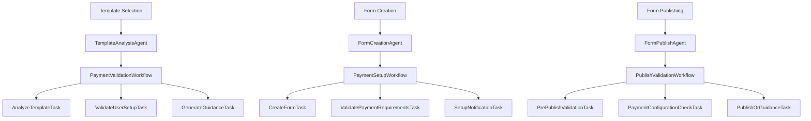
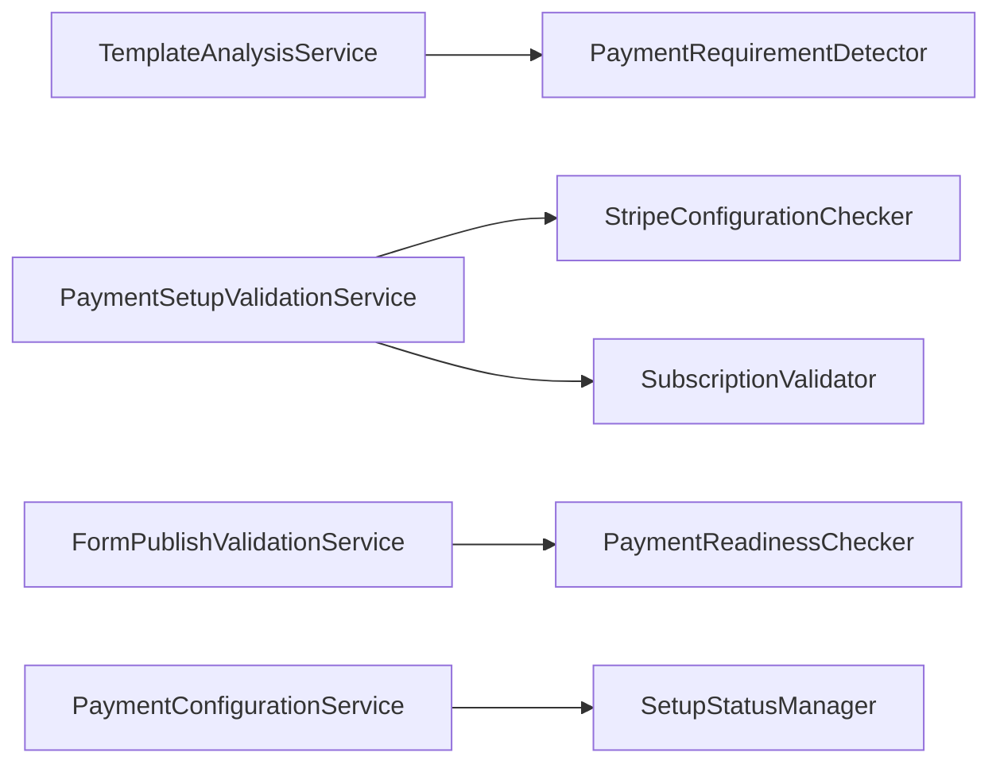

# Design Document

## Overview

The Template Payment Validation system addresses the critical gap in form generation workflow when users create forms from templates containing payment questions. The current implementation fails when users attempt to publish payment-enabled forms without proper Stripe configuration or Premium subscription, resulting in generic error messages and poor user experience.

This design implements a comprehensive validation and guidance system that proactively detects payment requirements, validates user configuration, and provides clear, actionable guidance throughout the form creation and publishing workflow.

## Architecture

### High-Level Architecture

The system follows the established AgentForm architecture pattern:
**Controllers → Agents → Workflows → Tasks → Services**



### Service Layer Architecture



## Components and Interfaces

### 1. Template Analysis Components

#### TemplateAnalysisService
```ruby
class TemplateAnalysisService < ApplicationService
  def analyze_payment_requirements(template)
    # Analyzes template for payment questions and requirements
    # Returns: { has_payment_questions: boolean, required_features: array, setup_complexity: string }
  end
  
  private
  
  def detect_payment_questions(template)
    # Scans template questions for payment types
  end
  
  def determine_required_features(payment_questions)
    # Maps payment question types to required features
  end
  
  def calculate_setup_complexity(features)
    # Determines setup complexity based on required features
  end
end
```

#### PaymentRequirementDetector
```ruby
class PaymentRequirementDetector
  PAYMENT_QUESTION_TYPES = %w[payment subscription donation].freeze
  
  def self.detect_in_template(template)
    # Static method to detect payment requirements in template
  end
  
  def self.required_features_for_questions(questions)
    # Maps question types to required platform features
  end
end
```

### 2. User Validation Components

#### PaymentSetupValidationService
```ruby
class PaymentSetupValidationService < ApplicationService
  def validate_user_requirements(user, required_features)
    # Validates user's current setup against requirements
    # Returns: { valid: boolean, missing_requirements: array, setup_actions: array }
  end
  
  private
  
  def check_stripe_configuration(user)
    # Validates Stripe setup completeness
  end
  
  def check_subscription_level(user, required_features)
    # Validates subscription meets feature requirements
  end
  
  def generate_setup_actions(missing_requirements)
    # Creates actionable setup steps for missing requirements
  end
end
```

#### StripeConfigurationChecker
```ruby
class StripeConfigurationChecker
  def self.configured?(user)
    # Checks if user has complete Stripe configuration
  end
  
  def self.configuration_status(user)
    # Returns detailed configuration status
  end
  
  def self.missing_configuration_steps(user)
    # Returns specific missing configuration elements
  end
end
```

### 3. Form Publishing Components

#### FormPublishValidationService
```ruby
class FormPublishValidationService < ApplicationService
  def validate_payment_readiness(form)
    # Comprehensive validation for form publishing with payment questions
    # Returns: { can_publish: boolean, validation_errors: array, required_actions: array }
  end
  
  private
  
  def validate_payment_questions(form)
    # Validates payment question configuration
  end
  
  def validate_user_payment_setup(user)
    # Validates user's payment configuration
  end
  
  def generate_publish_guidance(validation_errors)
    # Creates specific guidance for resolving publish issues
  end
end
```

### 4. Workflow Components

#### PaymentValidationWorkflow
```ruby
class PaymentValidationWorkflow < ApplicationWorkflow
  def execute(template:, user:)
    validate_and_prepare_template(template: template)
    analyze_payment_requirements(template: template)
    validate_user_setup(user: user, requirements: @requirements)
    generate_user_guidance(user: user, requirements: @requirements, validation: @validation)
  end
  
  private
  
  def validate_and_prepare_template(template:)
    # Task: Validates template and prepares for analysis
  end
  
  def analyze_payment_requirements(template:)
    # Task: Analyzes template for payment requirements
  end
  
  def validate_user_setup(user:, requirements:)
    # Task: Validates user's current setup against requirements
  end
  
  def generate_user_guidance(user:, requirements:, validation:)
    # Task: Generates specific guidance for user
  end
end
```

### 5. Frontend Components

#### PaymentSetupController (Stimulus)
```javascript
export default class extends Controller {
  static targets = ["setupChecklist", "requirementItem", "actionButton", "statusIndicator"]
  static values = { 
    hasPaymentQuestions: Boolean,
    stripeConfigured: Boolean,
    isPremium: Boolean,
    requiredFeatures: Array
  }
  
  connect() {
    this.updateSetupStatus()
    this.showRequiredActions()
  }
  
  updateSetupStatus() {
    // Updates UI based on current setup status
  }
  
  showRequiredActions() {
    // Displays required setup actions
  }
  
  initiateSetup(event) {
    // Handles setup action initiation
  }
  
  checkSetupProgress() {
    // Polls for setup completion status
  }
}
```

#### TemplatePreviewController (Stimulus)
```javascript
export default class extends Controller {
  static targets = ["paymentBadge", "requirementsList", "setupModal"]
  static values = { 
    templateId: String,
    hasPaymentQuestions: Boolean,
    requiredFeatures: Array
  }
  
  showPaymentRequirements() {
    // Displays payment requirements modal
  }
  
  proceedWithSetup() {
    // Initiates guided setup process
  }
  
  proceedWithoutSetup() {
    // Allows proceeding with setup reminders
  }
}
```

## Data Models

### Template Enhancement
```ruby
# Add to existing Template model or create TemplateMetadata
class Template < ApplicationRecord
  # Existing template code...
  
  def payment_requirements
    @payment_requirements ||= TemplateAnalysisService.new.analyze_payment_requirements(self)
  end
  
  def has_payment_questions?
    payment_requirements[:has_payment_questions]
  end
  
  def required_features
    payment_requirements[:required_features]
  end
  
  def setup_complexity
    payment_requirements[:setup_complexity]
  end
end
```

### Form Enhancement
```ruby
# Add to existing Form model
class Form < ApplicationRecord
  # Existing form code...
  
  def payment_setup_complete?
    return true unless has_payment_questions?
    
    user.stripe_configured? && user.premium?
  end
  
  def payment_setup_requirements
    return [] unless has_payment_questions?
    
    requirements = []
    requirements << 'stripe_configuration' unless user.stripe_configured?
    requirements << 'premium_subscription' unless user.premium?
    requirements
  end
  
  def can_publish_with_payments?
    !has_payment_questions? || payment_setup_complete?
  end
end
```

### User Enhancement
```ruby
# Add to existing User model
class User < ApplicationRecord
  # Existing user code...
  
  def payment_setup_status
    {
      stripe_configured: stripe_configured?,
      premium_subscription: premium?,
      can_accept_payments: can_accept_payments?,
      setup_completion_percentage: calculate_setup_completion
    }
  end
  
  private
  
  def calculate_setup_completion
    total_steps = 2 # Stripe + Premium
    completed_steps = 0
    completed_steps += 1 if stripe_configured?
    completed_steps += 1 if premium?
    (completed_steps.to_f / total_steps * 100).round
  end
end
```

## Error Handling

### Validation Error Structure
```ruby
class PaymentValidationError < StandardError
  attr_reader :error_type, :required_actions, :user_guidance
  
  def initialize(error_type:, required_actions:, user_guidance:)
    @error_type = error_type
    @required_actions = required_actions
    @user_guidance = user_guidance
    super(user_guidance[:message])
  end
end
```

### Error Types and Responses
```ruby
module PaymentValidationErrors
  STRIPE_NOT_CONFIGURED = {
    type: 'stripe_not_configured',
    message: 'Stripe configuration required for payment questions',
    action_url: '/stripe_settings',
    action_text: 'Configure Stripe'
  }.freeze
  
  PREMIUM_REQUIRED = {
    type: 'premium_subscription_required',
    message: 'Premium subscription required for payment features',
    action_url: '/subscription_management',
    action_text: 'Upgrade to Premium'
  }.freeze
  
  MULTIPLE_REQUIREMENTS = {
    type: 'multiple_requirements_missing',
    message: 'Multiple setup steps required for payment features',
    action_url: '/payment_setup_guide',
    action_text: 'Complete Setup'
  }.freeze
end
```

## Testing Strategy

### Unit Tests
- **Service Layer**: Test each service method with various input scenarios
- **Model Methods**: Test payment validation methods on Form and User models
- **Workflow Tasks**: Test individual workflow tasks with mocked dependencies
- **Error Handling**: Test error generation and formatting

### Integration Tests
- **Template Analysis**: Test complete template analysis workflow
- **User Validation**: Test user setup validation across different user states
- **Form Publishing**: Test publishing workflow with various payment configurations
- **Error Recovery**: Test error handling and recovery paths

### System Tests
- **Template Selection**: Test template selection with payment requirements
- **Guided Setup**: Test complete guided setup workflow
- **Form Creation**: Test form creation from payment templates
- **Publishing Flow**: Test publishing with and without proper setup

### Performance Tests
- **Template Analysis**: Test performance with large templates
- **Batch Validation**: Test validation of multiple forms/users
- **Background Jobs**: Test job processing performance and reliability

## Implementation Notes

### Phase 1: Core Validation Services
1. Implement TemplateAnalysisService and PaymentRequirementDetector
2. Implement PaymentSetupValidationService and related checkers
3. Add model enhancements for payment validation
4. Create comprehensive test suite for services

### Phase 2: Workflow Integration
1. Implement PaymentValidationWorkflow and related workflows
2. Integrate workflows with existing form creation and publishing flows
3. Add background job processing for complex validations
4. Test workflow integration thoroughly

### Phase 3: Frontend Enhancement
1. Implement Stimulus controllers for payment setup guidance
2. Create UI components for setup checklists and guidance
3. Integrate frontend components with existing form builder
4. Add real-time status updates and progress tracking

### Phase 4: Error Handling and Recovery
1. Implement comprehensive error handling system
2. Create user-friendly error messages and guidance
3. Add error recovery workflows and retry mechanisms
4. Test error scenarios and recovery paths

This design ensures a robust, user-friendly system that proactively guides users through payment setup requirements while maintaining the existing AgentForm architecture and user experience standards.